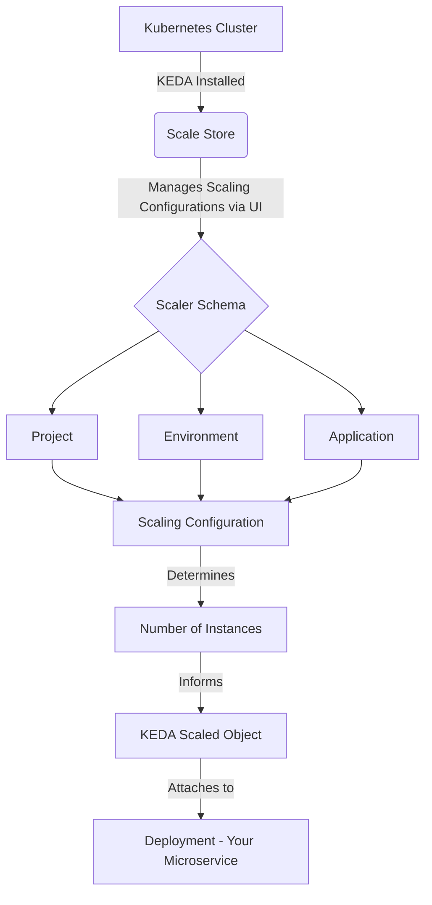

# Scale Store - Microservices Scaling Suite

## Overview
Scale Store is a microservices suite designed to simplify the management of scaling configurations for applications within Kubernetes environments. It offers a user-friendly interface to control the number of instances for each application, making it particularly useful in environments with predictable load patterns such as small government projects, internal company tools, and sandbox development environments. Scale Store's intuitive UI eliminates the need for direct manipulation of Kubernetes YAML files, streamlining the scaling process.


## Quick Demo

[](https://scalestoremedia.blob.core.windows.net/scalestore-assets/ScaleStoreDemo.mp4)


## Key Features
- **User-Friendly Interface**: Manage and store scaling configurations through a simple and intuitive UI.
- **Integration with Kubernetes and KEDA**: Seamlessly works with Kubernetes and KEDA to dynamically adjust application scaling.
- **Centralized Scaling Management**: Offers a centralized solution for controlling application scaling across different environments.
- **Flexible Scaling Options**: Suitable for a wide range of applications, including subsets within Kubernetes clusters.

## Architecture
Scale Store operates in conjunction with Kubernetes and KEDA. It is designed to be easily integrated into a Kubernetes cluster with KEDA installed. Once deployed using a Helm chart, Scale Store becomes the central hub for scaling configurations.

### Mermaid Diagram


## Usage
1. **Setup**: Install KEDA on your Kubernetes cluster.
2. **Deployment**: Deploy Scale Store using the Helm chart.
3. **Configuration via UI**:
   - No need to directly edit YAML files. Configure projects, environments, applications, and their scaling configurations through the Scale Store UI.
4. **KEDA Integration**:
   - KEDA ScaledObjects use the `get_number_of_instances` stored procedure, replacing the need for manual query configurations in YAML.
   - The stored procedure takes arguments for the application name, project, and environment, as specified in the UI.

### Example KEDA ScaledObject
```yaml
apiVersion: keda.sh/v1alpha1
kind: ScaledObject
metadata:
  name: authorization-service
spec:
  scaleTargetRef:
    name: authorization-service
  pollingInterval: 10   # Optional
  cooldownPeriod: 30    # Optional
  maxReplicaCount: 10   # Optional
  triggers:
    - type: postgresql
      metadata:
        connectionFromEnv: AUTH_SERVICE_DB_CONNECTION
        query: "SELECT get_number_of_instances('authorization-service', 'project-name', 'dev-environment')"
        targetQueryValue: "1"
```

## Note
- **Current Development Stage**: Scale Store is in active development and may not yet fulfill all production-ready criteria.
- **Community Contribution**: We welcome feedback and contributions to enhance Scale Store's capabilities and usability.


# Azure DevOps Board

This document provides a direct link to the Azure DevOps Board for ScaleStore.

[Access the ScaleStore Team's Azure DevOps Board here](https://dev.azure.com/OpenStoreK8s/ScaleStore/_boards/board/t/ScaleStore%20Team/Issues)

